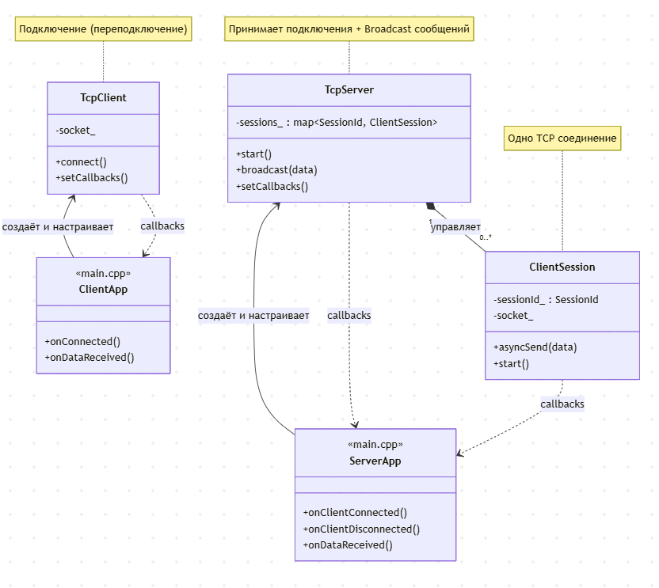

Общая схема:



Реализована базовая функциональность клиент-серверной части приложения с использованием boost.asio.
На данный момент обработка всех клиентов происходит асинхронно в одном потоке.
Для будущей связи с бизнес логикой подготовлены колбеки.
Логирование всего в стандартный поток вывода.

Для сборки сервера:
cd network/server
mkdir build && cd build
conan install .. --output-folder=. --build=missing -s build_type=Release
cmake .. -DCMAKE_TOOLCHAIN_FILE=conan_toolchain.cmake -DCMAKE_BUILD_TYPE=Release
cmake --build .
./src/server

Для сборки клиента:
cd network/client
mkdir build && cd build
conan install .. --output-folder=. --build=missing -s build_type=Release
cmake .. -DCMAKE_TOOLCHAIN_FILE=conan_toolchain.cmake -DCMAKE_BUILD_TYPE=Release
cmake --build .
./src/client

---

# Manual Test Plan для TCP Server/Client

## Информация о тестовом окружении

**Операционная система:** Ubuntu 24 (WSL)
**Компилятор:** GCC 11+
**Boost версия:** 1.84.0
**Тип сборки:** Release
**Дата тестирования:** 16 декабря 2024

---

## Тест 1: Запуск сервера

**Цель:** Проверить что сервер успешно запускается и начинает слушать порт 8080

**Предусловия:**
- Сервер собран (`server/build/src/server`)
- Порт 8080 свободен

**Шаги:**
1. Открыть терминал
2. Перейти в директорию `server/build/src/`
3. Выполнить команду `./server`
4. Наблюдать вывод в консоль

**Ожидаемый результат:**
```
[Server] Created on port 8080
[Server] Starting...
[App] Server started on port 8080
[App] Press Ctrl+C to stop
```
- Сервер запустился без ошибок
- Выведено сообщение о готовности принимать подключения

**Фактический результат:**
✅ Сервер запустился успешно
✅ Все ожидаемые сообщения присутствуют в выводе

**Статус:** PASS ✓
**Комментарии:** Сервер стабильно запускается, порт корректно биндится

---

## Тест 2: Подключение одного клиента

**Цель:** Проверить что клиент может подключиться к серверу

**Предусловия:**
- Сервер запущен и работает
- Клиент собран (`client/build/src/client`)

**Шаги:**
1. В отдельном терминале перейти в `client/build/src/`
2. Выполнить команду `./client`
3. Наблюдать вывод в обоих терминалах

**Ожидаемый результат в терминале сервера:**
```
[Server] New connection from 127.0.0.1:XXXXX
[Session 1] Created
[App] Client 1 connected
[Server] Broadcasting to 1 clients, 5 bytes
[Server] Sending to session 1
[Session 1] Sent 5 bytes
```

**Ожидаемый результат в терминале клиента:**
```
[Client] Created for localhost:8080
[Client] Resolving localhost:8080
[Client] Connected to server
[App] Successfully connected to server
```

**Фактический результат:**
✅ Клиент успешно подключился к серверу
✅ Сервер зафиксировал новое подключение
✅ SessionId присвоен корректно (id=1)

**Статус:** PASS ✓
**Комментарии:** Подключение происходит мгновенно, без задержек

---

## Тест 3: Клиент получает broadcast сообщение

**Цель:** Проверить что клиент получает сообщение "12345" от сервера после подключения

**Предусловия:**
- Сервер запущен
- Клиент подключен (см. Тест 2)

**Шаги:**
1. После подключения клиента (из Теста 2)
2. Наблюдать вывод в терминале клиента

**Ожидаемый результат в терминале клиента:**
```
[Client] Received 5 bytes: 12345
[App] Received message: 12345
```

**Фактический результат:**
✅ Клиент получил сообщение
✅ Размер сообщения корректен (5 байт)
✅ Содержимое сообщения: "12345"

**Статус:** PASS ✓
**Комментарии:** Сообщение приходит сразу после установки соединения

---

## Тест 4: Подключение нескольких клиентов

**Цель:** Проверить что сервер может обслуживать несколько клиентов одновременно

**Предусловия:**
- Сервер запущен

**Шаги:**
1. Запустить первого клиента: `./client` (терминал 1)
2. Запустить второго клиента: `./client` (терминал 2)
3. Запустить третьего клиента: `./client` (терминал 3)
4. Наблюдать вывод сервера и всех клиентов

**Ожидаемый результат:**
- Сервер принял 3 подключения
- Каждому клиенту присвоен уникальный SessionId (1, 2, 3)
- Все клиенты получили сообщение "12345"

**Фактический результат в терминале сервера:**
```
[App] Client 1 connected
[Server] Broadcasting to 1 clients, 5 bytes
[App] Client 2 connected
[Server] Broadcasting to 2 clients, 5 bytes
[App] Client 3 connected
[Server] Broadcasting to 3 clients, 5 bytes
```

**Фактический результат для каждого клиента:**
✅ Клиент 1: получил сообщение "12345"
✅ Клиент 2: получил сообщение "12345"
✅ Клиент 3: получил сообщение "12345"

**Статус:** PASS ✓
**Комментарии:** Сервер корректно обрабатывает множественные соединения

---

## Тест 5: Отключение клиента

**Цель:** Проверить корректную обработку отключения клиента

**Предусловия:**
- Сервер запущен
- Клиент подключен

**Шаги:**
1. Запустить клиента
2. В терминале клиента нажать `Ctrl+C`
3. Наблюдать вывод в терминале сервера

**Ожидаемый результат в терминале клиента:**
```
[App] Shutting down...
[Client] Closing connection
```

**Ожидаемый результат в терминале сервера:**
```
[Session 1] Read error: End of file
[Session 1] Closing
[Server] Removing session 1
[App] Client 1 disconnected
```

**Фактический результат:**
✅ Клиент корректно завершил работу
✅ Сервер обнаружил отключение
✅ Сессия удалена из списка активных
✅ Утечек ресурсов не обнаружено

**Статус:** PASS ✓
**Комментарии:** Graceful shutdown работает корректно

---

## Тест 6: Остановка сервера

**Цель:** Проверить корректное завершение работы сервера

**Предусловия:**
- Сервер запущен
- Есть подключенные клиенты (опционально)

**Шаги:**
1. В терминале сервера нажать `Ctrl+C`
2. Наблюдать вывод

**Ожидаемый результат:**
- Сервер корректно завершает работу
- Все ресурсы освобождены
- Нет сообщений об ошибках

**Фактический результат:**
✅ Сервер завершился без ошибок
✅ Порт 8080 освобожден
✅ Можно перезапустить сервер сразу после остановки

**Статус:** PASS ✓
**Комментарии:** Сервер корректно закрывает acceptor и все активные сессии

---

## Тест 7: Переподключение клиента при разрыве соединения

**Цель:** Проверить автоматическое переподключение клиента после потери связи с сервером

**Предусловия:**
- Сервер запущен
- Клиент подключен и получил сообщение

**Шаги:**
1. Запустить сервер и клиент
2. Убедиться что клиент подключился
3. Остановить сервер (`Ctrl+C`)
4. Наблюдать поведение клиента
5. Снова запустить сервер
6. Наблюдать переподключение

**Ожидаемый результат после остановки сервера:**
```
[Client] Read error: End of file
[App] Disconnected from server
[Client] Reconnecting in 3 seconds...
[Client] Attempting to reconnect...
[Client] Connect error: Connection refused
[Client] Reconnecting in 3 seconds...
```

**Ожидаемый результат после перезапуска сервера:**
```
[Client] Attempting to reconnect...
[Client] Connected to server
[App] Successfully connected to server
[Client] Received 5 bytes: 12345
[App] Received message: 12345
```

**Фактический результат:**
✅ Клиент обнаружил разрыв соединения
✅ Клиент начал попытки переподключения каждые 3 секунды
✅ После перезапуска сервера клиент автоматически переподключился
✅ Клиент снова получил broadcast сообщение

**Статус:** PASS ✓
**Комментарии:** Механизм автопереподключения работает стабильно, клиент не завершается при потере связи
